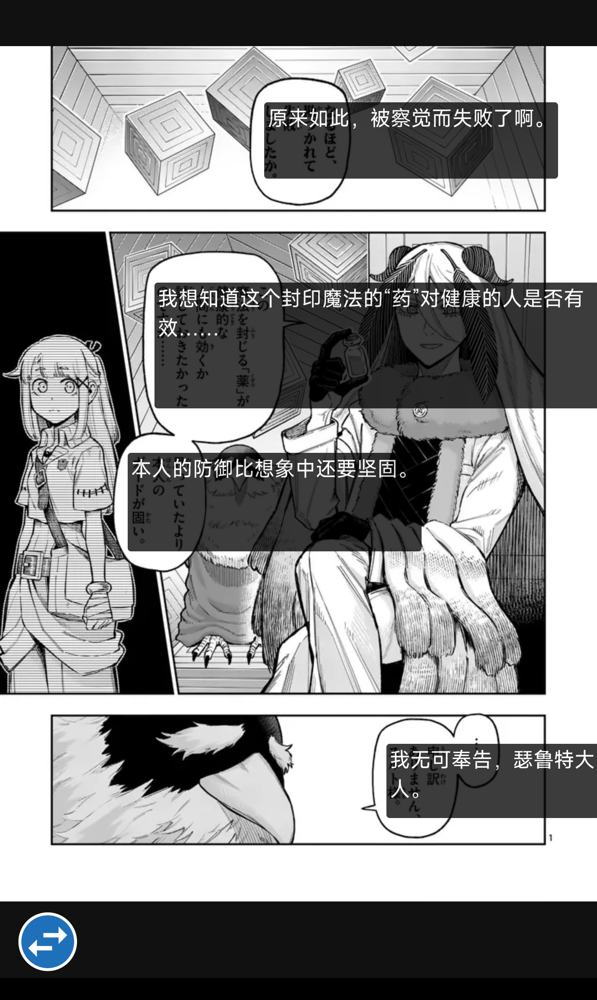
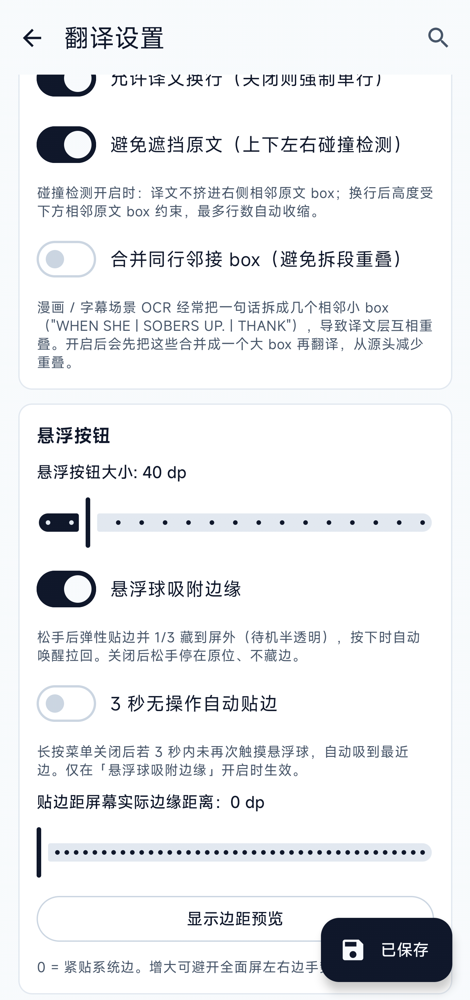

<div align="center">

[简体中文](README.md) · **English**

# Screen Translator

**Real-time on-screen translator for Android · capture → OCR → translate → overlay**

[](LICENSE)
[](../../releases)
[](../../releases)
[](../../stargazers)
[](../../issues)


Capture via MediaProjection / Shizuku → on-device or cloud OCR → LLM / MT → floating overlay.
No ROOT, fully self-contained, designed for visual novels, manga, game dialogue and any on-screen text.

[Install](#-install) · [Usage](#-usage) · [Configuration](#%EF%B8%8F-configuration) · [Contributing](#-contributing) · [Releases](../../releases) · [Issues](../../issues)

</div>

---

## ✨ Features

### 🎯 In one line

Game / manga / visual novel on screen → tap the floating ball → translation appears overlaid on the source text in a couple of seconds.

### 🖱️ How to trigger

- **Floating ball**: tap for one-shot translation; long-press opens an arc menu (loop translate / re-pick region / back to main app)
- **Loop mode**: auto-translate every 2 s; static frames are skipped automatically — read a novel without lifting your finger
- **Volume two-key**: hold **Vol+ and Vol−** together for 0.3 s to trigger; your hands stay on the game (requires enabling the bundled accessibility service)

### 🔍 OCR (read the text on screen)

- **On-device**: ML Kit (CJK + Latin) / PaddleOCR — your screenshots never leave the phone; works offline
- **Cloud**: Baidu / Tencent / Youdao — fall back to these when on-device misreads
- When you switch source language, the app checks whether the current OCR engine can read it; if not, it suggests a better one

### 🌐 Translation engines

- **LLMs**: DeepSeek / ChatGPT / Zhipu / self-hosted models… streamed token by token, no waiting for the whole reply
- **DeepL**: free / Pro plan auto-detected, **supports self-hosted [deeplx](https://github.com/OwO-Network/DeepLX)** (open-source proxy, run on your own server, no key needed); pick between Official / deeplx / Auto-fallback
- **Youdao Pic-Trans**: skips the OCR step entirely — send the screenshot, get back boxes with translations. Great for comics.
- **Google**: no key, free (proxy required inside mainland China)
- Every engine has a **Test connection** button; DeepL additionally reports remaining monthly free quota

### 🎨 How the overlay looks

- **Two placements**: stuck to the source text, or a single banner at the bottom of the screen
- **5 color themes** + font size, opacity, border — all tweakable
- **Comic / subtitle optimizations**: sentences split across multiple OCR boxes get merged before translating; vertical Japanese is read right-to-left; tiny ruby-text columns (furigana) next to kanji are filtered out so you don't get duplicate translations
- **Marquee for long lines**: in single-line mode, long translations scroll horizontally instead of being truncated with "…"

### 🛠️ Small conveniences

- **English / 简体中文 UI + Light / Dark / Follow-system theme**, applies instantly
- **In-settings search**: can't find an option? Search in either language at the top of the settings page
- **Translation cache**: identical lines don't burn through your API quota twice
- **Auto-saved crash reports**: if the app crashes or freezes, the next launch lets you view and export a sanitized report in one tap
- **Update prompt**: checks for new versions when you open the home screen (at most once a day); offers a direct link if GitHub is unreachable
- **Chinese-ROM background guides**: shortcuts to auto-start / battery whitelist settings for Xiaomi / OPPO / VIVO / Huawei / Samsung devices that aggressively kill background services
- **Privacy default**: cleartext HTTP is only allowed inside your LAN by default; public hosts must use HTTPS

## 📊 Comparison with similar apps

> Rough reference compiled from publicly available info in 2026; the other apps may have moved on. PRs welcome to correct.

| Aspect | **Screen Translator (this)** | Gaminik / Aiyike (same codebase, proprietary) | Google Translate | Immersive Translate |
|---|---|---|---|---|
| Free / no ads | ✅ | Subscription or IAP | ✅ | ✅ |
| Open source | ✅ Apache 2.0 | ❌ | ❌ | Partial |
| Floating-ball overlay translation | ✅ | ✅ | ❌ | ❌ (weak on mobile) |
| On-device OCR (no image upload) | ✅ | ❌ (cloud-first) | ✅ | ❌ |
| Pluggable OCR + translation engines (incl. LLM) | ✅ | Limited | ❌ | Translation only |
| Self-hosted backend (deeplx / local LLM) | ✅ | ❌ | ❌ | ❌ |
| Comic vertical / furigana / subtitle paragraph merge | ✅ | ❌ | ❌ | ❌ |

**Positioning**: in the "game / manga on-screen translation" niche, be the only one that is **open source + on-device-engine-capable + self-host-friendly**. The differentiation against incumbents lives in *privacy / self-hosting / engine choice*, not in OCR or translation quality itself (anyone can plug into the same cloud OCR and DeepL/LLM engines).

## 📸 Screenshots

**Live overlay** — Discord rules page, OCR boxes glued to the source text:

| Classic Dark | Paper Light |
|---|---|
|  |  |

**In-game** — Sandship UI, Chinese detected and overlaid:


**Comic / subtitle scene** — manga bubbles OCR'd by column, translation glued to source:

| Korean manga | Vertical Japanese manga |
|---|---|
|  |  |

**Settings**:

| App language / theme / translator | OCR engine / preprocessing |
|---|---|
|  |  |
| **Overlay style preview** | **Box merge / floating ball** |
|  |  |

## 📦 Install

1. Grab the latest `ScreenTranslator-x.y.z.apk` from [Releases](../../releases)
2. Tap it on your Android device (first time you'll need to allow "Install unknown apps" in system settings)
3. Grant **Overlay** and **Notification** permissions on first launch

Only **`arm64-v8a` (64-bit ARM)** is published. armeabi-v7a / x86 are **not supported for now** — on-device OCR engines (PaddleOCR / ML Kit) ship large native libs, and 32-bit ARM lacks 64-bit NEON optimizations and has fewer registers, making inference noticeably slower and OCR wait times much longer. If you have a 32-bit device that needs this, please open an issue.

Each APK ships with a `.sha256` so you can verify integrity against `Get-FileHash` / `sha256sum`.

## 🚀 Usage

1. Open the app, tap **Start capture service**, accept the system "Start recording?" dialog
2. Switch to any game / VN / manga app
3. Tap the floating button → translation appears in ~2-3 s
4. Long-press the floating button → toggle loop mode (every 2 s default; the outer progress ring sweeps once per capture; dHash skips still frames)
5. Tap the translation bar → hide

Optional:
- Enable the accessibility service so **holding Vol+ and Vol- together for 300 ms** acts as a global trigger (no screen-reading, no view-tree parsing)
- Install [Shizuku](https://github.com/RikkaApps/Shizuku) and grant permission; in settings, switch the capture path to Shizuku to skip the per-session system dialog

## ⚙️ Configuration

Open the app and tap **Settings**. The top of the settings page lets you switch **App language** and **Theme**; any section is reachable through the search icon, matching both Chinese and English keywords.

### OCR engines

| Engine | Good for | Notes |
|---|---|---|
| **On-device** ML Kit (auto / latin / ja / zh / ko) | Default; Japanese / Chinese / Korean / Latin | Offline, on-device |
| **On-device** PaddleOCR PP-OCRv5 mobile | Multilingual dense text, UI buttons | First use needs ONNX model download — see below |
| **Cloud** Baidu OCR | Fallback when ML Kit / Paddle miss | Needs API Key + Secret, pay-per-call; 5 endpoints (basic / with-position / accurate / accurate-with-position / web-image); image size / aspect-ratio limits |
| **Cloud** Tencent OCR | Same | Needs SecretId + SecretKey; 3 endpoints: GeneralBasic / GeneralAccurate / **RecognizeAgent** (LLM agent, integrated with ParagNo paragraph grouping) |
| **Cloud** Youdao OCR | Simple one-tap | Needs App ID (API Key) + App Secret; `langType` auto-derived from source language, no separate picker |

**PaddleOCR model download**: Settings → "Download PaddleOCR model" pulls the following three files from HuggingFace / hf-mirror into `<filesDir>/models/paddle/`:

- `det.onnx` (DBNet detector, ~4.5 MB)
- `rec.onnx` (CRNN recognizer, ~15.7 MB)
- `keys.txt` (v5 dictionary, ~90 KB)

You can override the mirror URL in settings, or import the files manually from local storage.

**Baidu OCR caveats**: image limits are *longest side ≤ 4096 px, shortest side ≥ 15 px, aspect ratio 1:4–4:1, base64 < 4 MB*. The first two are handled automatically (downscale + JPEG quality fallback); aspect ratio out of range can only be fixed by shrinking the capture region.

### Translation engines

**OpenAI-compatible**:

- **Base URL**: end with `/v1/`, e.g.:
  - SiliconFlow `https://api.siliconflow.cn/v1/`
  - OpenAI `https://api.openai.com/v1/`
  - Zhipu BigModel `https://open.bigmodel.cn/api/paas/v4/`
  - Self-hosted Ollama `http://<host>:11434/v1/`
- **API Key**: the `sk-xxx` from your provider
- **Model name** (examples):
  - SiliconFlow: `Qwen/Qwen2.5-7B-Instruct`, `Qwen/Qwen2.5-14B-Instruct`
  - OpenAI: `gpt-4o-mini`, `gpt-4o`
  - Zhipu: `glm-4-flash`, `glm-4-plus`
  - Ollama: `qwen2.5:7b`, `llama3.1:8b`
- **Prompt template**: defaults to a galgame conversational style and is editable. The default prompt follows the UI language: if you never edited it, switching UI language migrates it to the new locale's default; customized prompts are left untouched.

**DeepL**: paste the Auth Key (free tier keys end with `:fx`); the free / pro endpoint is picked automatically. **Test connection** also returns this month's used / total character quota.

**Youdao PicTrans** (end-to-end engine): paste one Youdao App ID + App Secret (shared with the OCR side). When selected, CaptureService **bypasses the OCR engine setting** and sends the whole screenshot to `ocrtransapi`, which returns translated regions directly. Box coordinates are auto-rotated by orientation to fix position offsets on rotated images. **Test connection** ships a 2×2 px tiny image and parses errorCode to distinguish key / service / rate-limit issues.

**Google** (unofficial endpoint): no key needed, free. **Proxy required inside mainland China**; Google may rate-limit or change the endpoint at any time — for learning only.

### Display

- **Render mode**: BLOCKS (per OCR box, glued to source) / BANNER (one bar at the bottom)
- **Placement** (BLOCKS only): below / overlap / above + pixel-level x/y offset
- **Theme**: 5 presets + custom (bg / fg / border ARGB)
- **Avoidance & merge**: collision detection clamps translation width so it doesn't bleed into neighbouring OCR boxes; OCR-side box merging offers **Conservative / Standard / Aggressive** strengths — Conservative suits VNs / dense passages, Standard fits most scenes, Aggressive suits comic bubbles split into many columns (may occasionally merge adjacent bubbles)

## ⚠️ Known limitations

- Android 14+ shows a system permission dialog on every fresh capture session — that's by design. The Shizuku path avoids it.
- Some ROMs (Xiaomi / OPPO / VIVO) kill background services or block overlays by default. You need to whitelist battery + allow background start manually. The app provides in-product shortcuts.
- Anti-cheat networked games may flag MediaProjection as a screen-recorder cheat — this project is for single-player / VN / manga only.
- Screens marked `FLAG_SECURE` (some banking / video apps) capture as black; this project does not bypass it.
- PaddleOCR on-device inference takes 1–3 s per shot on entry-level devices (Snapdragon 7-series or lower). Use region selection alongside.
- Chinese ROMs (HyperOS / MIUI, etc.) silently drop background-Service toasts; OCR / network failures, loop toggle, etc. now use floating overlays (red error bar auto-dismisses in 4.5 s, gray info bar in 1.8 s).
- Auto-start permission is a vendor-specific concept and **Android has no public API to query it** — the button is always tappable and just opens the ROM's own auto-start list for you to flip the switch manually. Battery whitelist uses the standard system API and shows "Already enabled" once granted.

## 🗺️ Roadmap

### ✅ Done

- [x] **Core pipeline** (M0): capture → OCR → translation → overlay, end-to-end
- [x] **UX polish** (M1): region memory, streamed translation, source-glued rendering, ROM guides, EN/CN UI + light/dark themes, in-settings search
- [x] **Smarts & stability** (M2): Korean recognition, volume two-key global trigger, source-lang ↔ OCR linkage hints, paragraph merge with 3 strengths, loop progress ring, auto-saved crash reports, update prompts
- [x] **Engine expansion** (M3 · 0.3.x): test-connection button on every engine, Youdao OCR + PicTrans, Google translate, Tencent agent paragraph grouping, furigana filter, marquee scrolling for long lines

### 📋 Planned

- [ ] Background-aware overlay (auto color + adaptive font size, replacing the solid rectangle)
- [ ] On-device manga-specific OCR (manga-ocr model)
- [ ] Custom overlay fonts (upload your own .ttf)
- [ ] Advanced Shizuku path (more robust no-permission-dialog capture)
- [ ] Translation conversation history
- [ ] Text-to-speech for translations
- [ ] Glossary (fixed translations for names / items)

## 🤝 Contributing

Contributions of any kind — bug fixes, features, UI polish, translations, doc tweaks — are welcome.

### Branch & PR rules

> ⚠️ **Do not open PRs against `main`.**
>
> `main` is the stable trunk that drives releases; **only maintainer-reviewed merges land there**.
>
> External contributors:

1. **Open an issue first** to discuss direction — avoid wasted work / scope mismatches
2. **Fork** the repo, branch off the latest `main`:
   ```bash
   git checkout -b feat/your-idea origin/main
   ```
3. **Develop and test locally** (at least `./gradlew installDebug` on a real device)
4. **Open the PR against `dev`** (if `dev` doesn't exist yet, ping the maintainer in the issue to create it). The maintainer aggregates multiple PRs on `dev`, retests, then merges into `main`
5. **Direct push / force-push to `main` is forbidden** (enforced by branch protection)

### Build locally

```bash
git clone https://github.com/ciddwd/overlay-translator.git
cd overlay-translator
cp local.properties.example local.properties
# Edit local.properties and point sdk.dir at your local Android SDK
./gradlew installDebug   # installs onto the connected device
```

Requires JDK 17 + Android SDK 35. Opening the project in Android Studio auto-syncs and fills in the Gradle wrapper jar; on a bare CLI environment, run `gradle wrapper --gradle-version 8.10.2` first.

### Translation contributions

To add a new language or fix an existing one:

1. Copy `app/src/main/res/values/strings.xml` to `app/src/main/res/values-<lang>/strings.xml` (e.g. `values-zh-rTW`, `values-ja`)
2. Translate the **values** inside `<string>` tags only. **Keep** the `name="..."` key and placeholders (`{source}`, `{target}`, `%1$s`, `\n`, etc.)
3. Add `<locale android:name="<lang>" />` to `app/src/main/res/xml/locales_config.xml`
4. Append a row to `APP_LANGUAGE_OPTIONS` in `app/src/main/java/com/gameocr/app/ui/SettingsScreen.kt`
5. In the PR description, attach coverage (X / Y strings translated) and screenshots of the localized settings page

We may migrate to [Weblate](https://weblate.org/) when there are 10+ languages.

### Commit messages

Use a simplified [Conventional Commits](https://www.conventionalcommits.org/):

```
feat: new feature
fix:  bug fix
docs: documentation
refactor: refactor (no behaviour change)
chore: build / CI / tooling
i18n: translations
```

Write the subject in either English or Chinese — **don't mix in one line**. Keep the first line ≤ 72 chars.

### Code of conduct

- Be civil, stay on topic
- No off-topic content, ads, or politics
- Maintainers reserve the right to close issues / PRs that don't match the project direction, with a brief reason

## 🙏 Acknowledgements

### Upstream

- [PaddleOCR](https://github.com/PaddlePaddle/PaddleOCR) · PP-OCRv5 mobile model
- [bukuroo/PPOCRv5-ONNX](https://huggingface.co/bukuroo/PPOCRv5-ONNX) · ONNX-converted v5 mobile mirror
- [Shizuku](https://github.com/RikkaApps/Shizuku) · privileged channel without ROOT
- [ML Kit](https://developers.google.com/ml-kit) · Google's on-device OCR
- [ONNX Runtime](https://onnxruntime.ai/) · on-device inference engine
- [Jetpack Compose](https://developer.android.com/jetpack/compose) / [Material 3](https://m3.material.io/) · UI stack
- [Hilt](https://dagger.dev/hilt/) · dependency injection
- [Retrofit](https://square.github.io/retrofit/) + [OkHttp](https://square.github.io/okhttp/) · networking
- [kotlinx.serialization](https://github.com/Kotlin/kotlinx.serialization) · JSON
- [Timber](https://github.com/JakeWharton/timber) · logging

### Contributors

<a href="https://github.com/ciddwd/overlay-translator/graphs/contributors">
  
</a>

(Will appear automatically after the first PR is merged.)

### Inspiration

PC tools in the VNR / Visual Novel Reader family have served galgame / VN players for years. This project carries that pipeline to Android, redesigned for the phone (battery, ROM constraints, touch UI).

## 📄 License

Code is licensed under [Apache-2.0](LICENSE). Models and third-party dependencies retain their own licenses.

