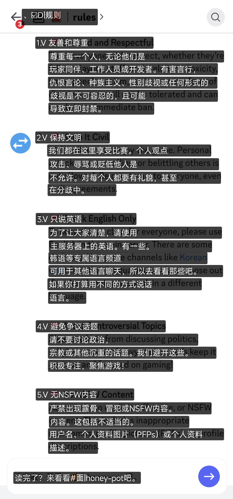
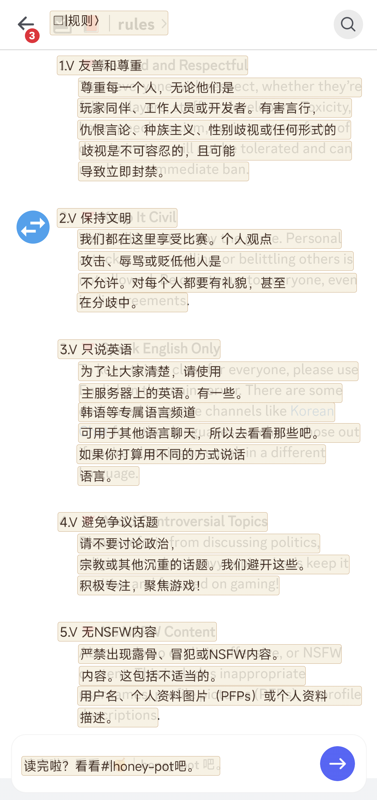
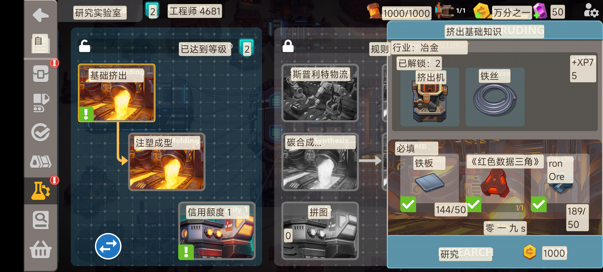
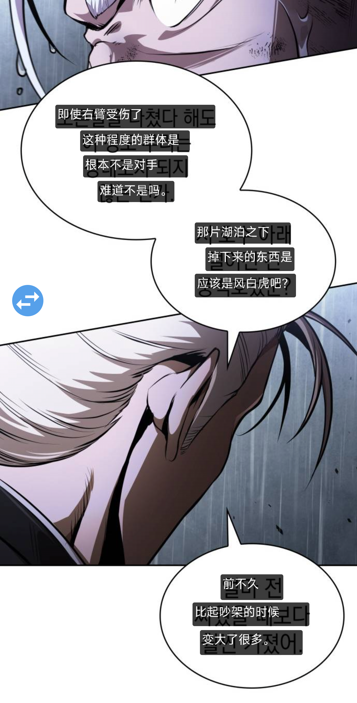
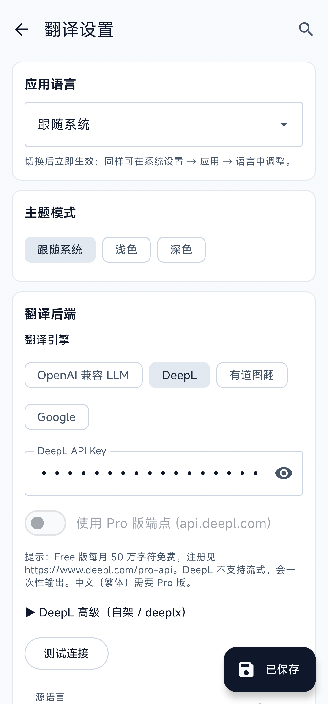
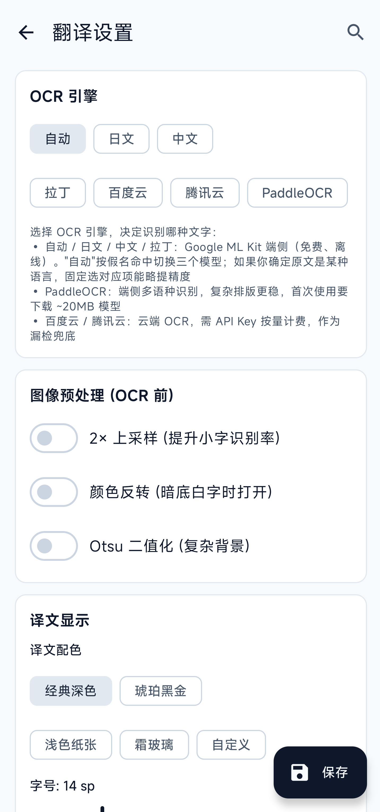
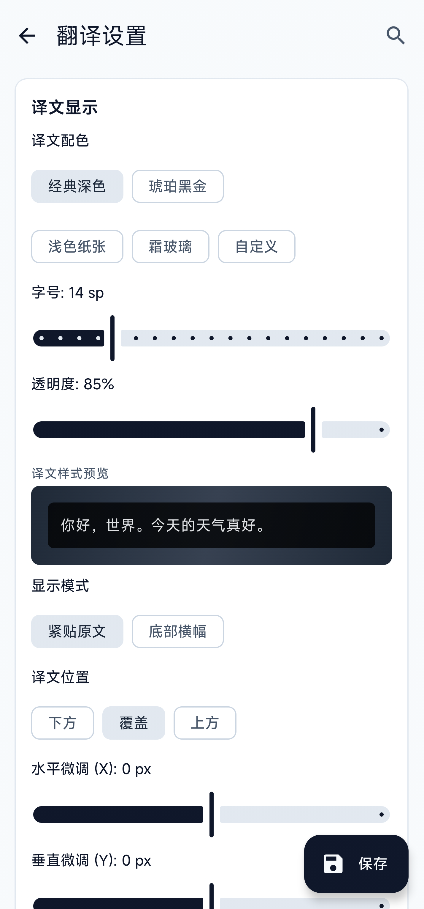

<div align="center">

**简体中文** · [English](README.en.md)

# 屏译 · PingYi

**Android 屏幕实时翻译 · 截屏 → OCR → 翻译 → 悬浮窗叠加**

[](LICENSE)
[](../../releases)
[](../../releases)
[](../../stargazers)
[](../../issues)


通过 MediaProjection / Shizuku 截屏 → 端侧或云端 OCR → LLM / 机器翻译 → 悬浮窗叠加显示。
无需 ROOT，单机可用，面向视觉小说、漫画、游戏对话等任意屏上文字的实时翻译。

[安装](#-安装) · [使用](#-使用) · [配置](#-配置) · [参与开发](#-参与开发) · [Releases](../../releases) · [Issues](../../issues)

</div>

---

## ✨ 功能

- **截屏**：MediaProjection + ImageReader（前台服务 `mediaProjection` 类型，Android 14+ 兼容）；可选 Shizuku 路径免每次系统授权弹窗
- **触发**：悬浮按钮单击触发一次，长按切循环模式（默认 2 秒一次，dHash 帧差跳过静止画面，圆球外圈进度环可视化倒计时）；可选无障碍服务接管 **音量+ 与 音量- 同时按 300ms** 作为全局触发
- **区域选择**：全屏拉框，记忆上次区域，避免 OCR 全屏背景噪声
- **OCR 引擎**（路由式，按设置切换）：
  - ML Kit 端侧（拉丁 / 日 / 中 / 韩，AUTO 按字符集命中切换）
  - PaddleOCR PP-OCRv5 mobile（ONNX Runtime，端侧多语种）
  - 云端兜底：百度 OCR / 腾讯 OCR（含位置含语种参数）
- **源语言 ↔ OCR 联动**：你切源语言时，自动检查当前 OCR 引擎能否识别它；不能 → 推荐切到合适引擎；当前云端用着"通用"模式但有精确语种可用 → 推荐升级。反向同理：改 OCR 端时建议把源语言切到匹配值，避免把你刚做的操作"撤销回去"
- **翻译**（路由式）：
  - OpenAI 兼容 chat completions（DeepSeek / SiliconFlow / 智谱 / Ollama / OpenAI ……）+ SSE 流式输出
  - DeepL（免费 / Pro 自动识别；用 DeepL 时自动隐藏与它无关的 Prompt / 流式设置）
- **叠加显示**：
  - 两种渲染模式：按 boundingBox 紧贴原文 / 屏幕底部整条横幅
  - 5 种内置主题（经典深色 / 琥珀黑金 / 浅色纸张 / 霜玻璃 / 自定义）+ 字号、透明度、边框、偏移微调
  - 智能避让相邻 OCR 框，可换行 / 紧凑单行
  - **合并相邻 box**（漫画 / 字幕场景必备）：OCR 经常把一句话切成几个相邻小 box，合并后整段送翻译可消除译文层互相重叠。提供 **保守 / 标准 / 激进** 三档强度，按场景选
  - LRU 翻译缓存，命中跳过 token 消耗
- **图像预处理**：2× 上采样、反色、Otsu 二值化（针对低对比度 / 暗底白字 / 颜色噪声）
- **应用本身**：
  - 中 / 英双语界面 + 浅色 / 深色 / 跟随系统 三档主题，皆即时生效
  - 设置页内搜索（中英关键字均可命中）
  - API Key / Secret 全部 password masking + 显示切换
  - **检查更新**：进主屏自动检查（24h 限频）+ 手动按钮，直连 GitHub Releases API，国内访问失败自动给"打开 Release 页"兜底
  - **闪退记录**：未捕获异常 + native crash / ANR / OOM kill（Android 11+）自动保存设备环境 + 脱敏设置快照 + stacktrace 到日志页，重启 App 即可查看 / 导出反馈给维护者
  - 厂商 ROM 兼容引导（自启动 / 电池白名单，含小米 / OPPO / VIVO / 华为 / 三星）

## 📸 截图

**实际译文叠加** —— Discord 沟通规则页，OCR 紧贴原文渲染：

| 经典深色主题 | 浅色纸张主题 |
|---|---|
|  |  |

**游戏场景** —— Sandship UI 的中文识别与覆盖：



**漫画 / 字幕场景** —— 韩文漫画气泡按列识别后中文译文紧贴覆盖：



**设置页**：

| 应用语言 / 主题 / 翻译后端 | OCR 引擎 / 预处理 | 译文样式预览 |
|---|---|---|
|  |  |  |

## 📦 安装

1. 到本仓库的 [Releases](../../releases) 页下载最新 `GameOcr-x.y.z.apk`
2. 在 Android 设备上点击安装（首次需在系统设置允许"安装未知来源应用"）
3. 启动后依次授予 **悬浮窗**、**通知** 权限

只发布 `arm64-v8a` 架构。每个 APK 同时附带 `.sha256` 校验文件，可对照本地 `Get-FileHash` / `sha256sum` 输出确认下载完整性。

## 🚀 使用

1. 启动 App，点 **启动截屏服务**，确认系统弹出的"开始截屏？"对话框
2. 切到任意游戏 / 视觉小说 / 漫画 App
3. 点屏幕上的圆形悬浮按钮 → 2~3 秒内底部出现译文
4. 长按悬浮按钮 → 切换循环模式（默认 2 秒一次，外圈进度环匀速转一圈对应一次截屏，dHash 跳过静止画面）
5. 单击译文条 → 隐藏

可选：
- 在系统"无障碍"里启用本应用，**同时按下音量加 / 音量减并按住 300ms** 作为全局触发，免去手指点屏（不读屏 / 不解析 View 树）
- 安装 [Shizuku](https://github.com/RikkaApps/Shizuku) 并授权后，在设置切换到 Shizuku 截屏路径，免去每次的系统授权弹窗

## ⚙️ 配置

启动 App 后进入"设置"。设置页顶部可切换 **应用语言** 与 **主题模式**；任意 section 都可用搜索图标按关键字（中英文都行）快速跳转。

### OCR 引擎

| 引擎 | 适用场景 | 备注 |
|---|---|---|
| ML Kit (auto / latin / ja / zh) | 默认；日文 / 中文 / 拉丁字符 | 无需外网，端侧推理 |
| PaddleOCR PP-OCRv5 mobile | 多语种密排文字、UI 按钮 | 首次使用需下载 ONNX 模型，见下 |
| 百度 OCR | ML Kit / Paddle 漏检兜底 | 需 API Key + Secret，按量计费；图片有尺寸 / 宽高比限制 |
| 腾讯 OCR | 同上 | 需 SecretId + SecretKey |

**PaddleOCR 模型下载**：设置 → "下载 PaddleOCR 模型"，自动从 HuggingFace / hf-mirror 镜像拉取以下三个文件到 `<filesDir>/models/paddle/`：

- `det.onnx`（DBNet 检测，约 4.5 MB）
- `rec.onnx`（CRNN 识别，约 15.7 MB）
- `keys.txt`（v5 字典，约 90 KB）

可在设置里自定义镜像 URL，或手动从本地文件导入。

**百度 OCR 注意事项**：图片限制为 *最长边 ≤ 4096px、最短边 ≥ 15px、宽高比 1:4 ~ 4:1、base64 后 < 4MB*。本项目对前两条会自动缩放兜底，宽高比超限只能调小 / 重画截屏区。

### 翻译引擎

**OpenAI 兼容**：

- **Base URL**：以 `/v1/` 结尾，例如：
  - SiliconFlow `https://api.siliconflow.cn/v1/`
  - OpenAI 官方 `https://api.openai.com/v1/`
  - 智谱 BigModel `https://open.bigmodel.cn/api/paas/v4/`
  - 自架 Ollama `http://<host>:11434/v1/`
- **API Key**：对应平台的 sk-xxx
- **模型名**（示例）：
  - SiliconFlow: `Qwen/Qwen2.5-7B-Instruct`、`Qwen/Qwen2.5-14B-Instruct`
  - OpenAI: `gpt-4o-mini`、`gpt-4o`
  - 智谱: `glm-4-flash`、`glm-4-plus`
  - Ollama: `qwen2.5:7b`、`llama3.1:8b`
- **Prompt 模板**：默认 galgame 口语化风格，可自定义。Prompt 跟随 UI 语言：从未改过 prompt 的用户切换 UI 语言时自动迁移到对应 locale 的默认 prompt；已自定义的 prompt 不会被覆盖。

**DeepL**：填 Auth Key（free 版 key 末尾带 `:fx`），自动选择 free / pro endpoint。

### 显示

- **渲染模式**：BLOCKS（按 OCR 框紧贴原文）/ BANNER（屏幕底部整条）
- **位置**：BLOCKS 下可选 below / overlap / above + 像素级 x/y 偏移微调
- **主题色**：5 种预设 + 自定义（背景 / 文字 / 边框 ARGB）
- **避让 & 合并**：碰撞检测限制译文宽度不挤进相邻 OCR 框；OCR 后合并相邻 box 提供 **保守 / 标准 / 激进** 三档强度——保守适合视觉小说 / 长段密集，标准适合多数场景，激进适合漫画气泡内多列被切碎的情形（可能误合相邻气泡）

## ⚠️ 已知限制

- Android 14+ 每次首次启动截屏都会弹一次系统授权窗，这是 Google 设计；Shizuku 路径可绕过
- 部分 ROM（小米 / OPPO / VIVO）默认杀后台 / 拦截悬浮窗，需手动加入电池白名单 + 允许后台启动；应用内有兼容引导
- 反作弊网游可能把 MediaProjection 判为外挂截屏 → 本项目仅适用于单机 / 视觉小说 / 漫画
- 设置了 `FLAG_SECURE` 的画面（部分网银 / 视频 App）截出来是黑屏，本项目不做绕过
- PaddleOCR 端侧推理在低端机（骁龙 7 系以下）单次约 1~3 秒；推荐配合区域选择使用
- 国产 ROM（HyperOS / MIUI 等）对后台 Service Toast 静默拦截，OCR / 网络失败、循环开关等提示已改用悬浮条（错误红底 4.5s、信息深灰 1.8s 自动消失）
- 自启动权限是各厂商私有概念，**Android 没有公开 API 可查询**——按钮始终可点、点完跳到 ROM 自己的列表页让你手动允许。电池白名单走系统标准 API，已加入会显示"已开启"

## 🗺️ 路线图

- **M0**：MediaProjection 截屏 + ML Kit + PaddleOCR + OpenAI 兼容翻译 + 悬浮按钮 + 底部译文条
- **M1**：区域选择持久化、SSE 流式译文、按 boundingBox 紧贴原文渲染、ROM 兼容引导、i18n（中英）+ 浅 / 深色主题、设置内搜索
- **M2（当前）**：韩文 ML Kit、音量双键全局触发、源语言 ↔ OCR 联动智能推荐、合并相邻 box 三档强度、循环模式进度环、闪退记录 + LogScreen、GitHub Releases 升级检测、DeepL 自动隐藏 LLM 专用项
- **M3**：Shizuku 高级路径完善（UserService + aidl）、多翻译引擎对比、对话历史、TTS、术语表、Weblate 社区翻译流程

## 🤝 参与开发

欢迎社区贡献。无论是 bug 修复、新功能、UI 改进、翻译还是文档勘误，都很受欢迎。

### 分支与 PR 规则

> ⚠️ **不要直接 PR 到 `main` 分支。**
>
> `main` 是稳定主线，**只接受经维护者审核合入** —— 用作打 tag 发版的基线。
>
> 外部 PR 请按以下流程走：

1. **先开 issue 讨论**：说明你想做的改动 / 修的 bug，确认方向，避免做白工
2. **Fork 仓库**，从最新 `main` 切出 feature 分支：
   ```bash
   git checkout -b feat/your-idea  origin/main
   ```
3. **本地开发并自测**（至少在一台真机上跑通 `./gradlew installDebug`）
4. **PR 提交到 `dev` 分支**（如仓库还没有 `dev`，请在 issue 里 ping 维护者建立）；维护者会在 `dev` 上聚合多人 PR、复测后整合到 `main`
5. **直接 push 到 `main` / 强推 `main` 是被禁止的**（仓库会通过 branch protection 拦截）

### 翻译贡献

如果想加入新语言或修正现有翻译：

1. 复制 `app/src/main/res/values/strings.xml` 到 `app/src/main/res/values-<lang>/strings.xml`（例如 `values-zh-rTW`、`values-ja`）
2. 只翻译 `<string>` 标签内的值，**保留** key（`name="..."`）和占位符（`{source}`、`{target}`、`%1$s`、`\n` 等）
3. 在 `app/src/main/res/xml/locales_config.xml` 添加 `<locale android:name="<lang>" />`
4. 在 `app/src/main/java/com/gameocr/app/ui/SettingsScreen.kt` 的 `APP_LANGUAGE_OPTIONS` 追加一行
5. 在 PR 描述里附上覆盖率（多少条字符串已翻译）与试译截图

未来若有 10+ 种语言，会迁移到 [Weblate](https://weblate.org/) 在线协作平台，简化流程。

### Commit message

推荐遵循 [Conventional Commits](https://www.conventionalcommits.org/) 简化版：

```
feat: 新功能
fix:  bug 修复
docs: 文档
refactor: 重构（不改行为）
chore: 构建 / CI / 工具链
i18n: 翻译相关
```

副标题与正文请用中文或英文，**不要混在一句话里**；首行 ≤ 72 字符。

### 行为准则

- 友善、就事论事，对人不动情绪
- 不发与项目无关的内容 / 商业推广 / 政治议题
- 维护者保留以"不符合项目方向"为由关闭 issue / PR 的权利，并会说明原因

## 🙏 致谢

### 上游项目

- [PaddleOCR](https://github.com/PaddlePaddle/PaddleOCR) · PP-OCRv5 mobile 模型
- [bukuroo/PPOCRv5-ONNX](https://huggingface.co/bukuroo/PPOCRv5-ONNX) · 已转 ONNX 的 v5 mobile 镜像
- [Shizuku](https://github.com/RikkaApps/Shizuku) · 免 ROOT 的高权限通道
- [ML Kit](https://developers.google.com/ml-kit) · Google 端侧 OCR
- [ONNX Runtime](https://onnxruntime.ai/) · 端侧推理引擎
- [Jetpack Compose](https://developer.android.com/jetpack/compose) / [Material 3](https://m3.material.io/) · UI 体系
- [Hilt](https://dagger.dev/hilt/) · 依赖注入
- [Retrofit](https://square.github.io/retrofit/) + [OkHttp](https://square.github.io/okhttp/) · 网络
- [kotlinx.serialization](https://github.com/Kotlin/kotlinx.serialization) · JSON 序列化
- [Timber](https://github.com/JakeWharton/timber) · 日志

### 贡献者

<a href="https://github.com/ciddwd/overlay-translator/graphs/contributors">
  
</a>

（首次 PR 合入后会自动出现在这里）

### 灵感来源

桌面端 VNR / Visual Novel Reader 等同类工具长期以来在 PC 平台为 galgame / 视觉小说玩家提供实时翻译。本项目把这条管线带到 Android，并针对手机场景（电池、ROM 限制、touch UI）做了重新设计。

## 📄 许可

代码采用 [Apache-2.0](LICENSE)。模型与第三方依赖各自保留原协议。

---

# 🛠️ 开发者文档

下面是开发者构建、调试与发版相关的内容；普通用户使用 [Releases](../../releases) 中的 APK 即可，不需要阅读这一部分。

## 技术栈

- Kotlin 2.x · Jetpack Compose · Hilt
- Android `minSdk 26` / `targetSdk 35`（Android 8.0+ 可运行，Android 10+ 体验最好）
- Retrofit + OkHttp + kotlinx.serialization
- DataStore（业务设置）+ SharedPreferences（主题 / locale 等需同步读取的偏好）+ Room（缓存）
- ONNX Runtime Android（PaddleOCR 端侧推理）
- ML Kit on-device text recognition
- Shizuku API

## 工程结构

```
app/src/main/java/com/gameocr/app/
  capture/    Screenshotter 接口 + MediaProjection / Shizuku 实现 + 区域选择 + 帧差
  ocr/        OcrEngine 接口 + ML Kit / PaddleOCR / 百度 / 腾讯 + RoutingOcrEngine
  translate/  Translator 接口 + OpenAI / DeepL + LRU 缓存 + RoutingTranslator
  overlay/    悬浮按钮 + 译文 / loading / 错误悬浮条
  service/    CaptureService 前台服务（截屏 → OCR → 翻译 → 渲染 主控）
  trigger/    无障碍服务（音量键触发器，可选）
  shizuku/    Shizuku 权限与 IBinder 桥接
  rom/        小米 / OPPO / VIVO 等厂商 ROM 兼容引导
  data/       Settings 模型 + DataStore Repository + ThemeModePrefs + AppLocalePrefs
  di/         Hilt 模块
  ui/         MainActivity + MainScreen + SettingsScreen + LogScreen + Compose 主题

app/src/main/res/
  values/                默认（中文）strings.xml + themes.xml + colors.xml
  values-en/             英文 strings.xml
  xml/locales_config.xml 应用支持的 per-app locale 清单（Android 13+）

tools/local_ocr_debug/  PC 端复现 PaddleOCR 流水线的 Python 脚本（见"开发与调试"）
.github/workflows/      CI：push tag 自动发版到 Releases
```

## 构建

### 准备

- Android Studio Ladybug (2024.2) 或更新；JDK 17（Android Studio 自带）
- Android SDK 35（compileSdk）+ Build-Tools 34+
- 设备 / 模拟器：Android 8.0 (API 26) 起

### 克隆与配置

```bash
git clone https://github.com/ciddwd/overlay-translator.git
cd overlay-translator
cp local.properties.example local.properties
# 编辑 local.properties，把 sdk.dir 改成本机 Android SDK 路径
```

### 补齐 Gradle Wrapper jar

仓库未提交 `gradle/wrapper/gradle-wrapper.jar`（避免二进制入库），两种方式补：

- **方法 A（推荐）**：用 Android Studio 打开项目根目录，IDE 会自动下载 wrapper 并 sync
- **方法 B**：已装 Gradle 8.10+ 的环境下，根目录执行 `gradle wrapper --gradle-version 8.10.2`

### 编译

```bash
./gradlew assembleDebug          # 产物：app/build/outputs/apk/debug/app-debug.apk
./gradlew installDebug           # 直接安装到已连接设备
```

只支持 `arm64-v8a`（在 `app/build.gradle.kts` 的 `ndk.abiFilters` 配置；为控制 APK 体积，不打包 32 位与 x86）。

## 开发与调试

### PaddleOCR 本地调参

`tools/local_ocr_debug/` 提供 Python 脚本，可在 PC 上完整复现 Android 端 PaddleOCR 流水线，用于离线调参与回归对比：

```bash
# 1. 从设备拉出已安装的 ONNX 模型
adb exec-out "run-as com.gameocr.app.debug cat files/models/paddle/det.onnx" > tools/local_ocr_debug/models/det.onnx
adb exec-out "run-as com.gameocr.app.debug cat files/models/paddle/rec.onnx" > tools/local_ocr_debug/models/rec.onnx
adb exec-out "run-as com.gameocr.app.debug cat files/models/paddle/keys.txt" > tools/local_ocr_debug/models/keys.txt

# 2. 抓一张待测截图
adb exec-out screencap -p > sample.png

# 3. 用与 Android 端 1:1 等价的算法跑一遍
pip install onnxruntime pillow numpy opencv-python-headless pyclipper shapely
python tools/local_ocr_debug/run_v3_kotlin_equiv.py sample.png
```

输出 `sample.png.v3.png` 是带框可视化，控制台逐行打印每个检测框的位置、平均得分与识别文本。

仓库内还有 `run_v2.py`（PaddleOCR 官方做法对照基线，依赖 cv2 + pyclipper）用于评估改动收益。

## 发版

打 tag → 自动构建 → 上传到 GitHub Releases。`.github/workflows/release.yml` 在 `push tag v*` 时触发，跑 `assembleRelease` 并把签名 APK + sha256 发到对应 Release。

### 一次性：配置签名 keystore 与 GitHub Secrets

```bash
# 本地生成发布 keystore（密码、alias 自定，妥善保存）
keytool -genkeypair -v \
  -keystore release.jks \
  -keyalg RSA -keysize 2048 -validity 36500 \
  -alias gameocr \
  -storepass <STORE_PASSWORD> -keypass <KEY_PASSWORD> \
  -dname "CN=GameOcr, OU=, O=, L=, ST=, C=CN"

# 转 base64 用于 GitHub Secrets（macOS/Linux 用 base64 -w0 release.jks）
certutil -encode release.jks release.jks.b64   # Windows
# 把 release.jks.b64 中 -----BEGIN/END----- 之间的内容（多行无所谓）复制走
```

在仓库 **Settings → Secrets and variables → Actions** 新增 4 个 secret：

| Secret | 内容 |
|---|---|
| `RELEASE_KEYSTORE_BASE64` | 上一步生成的 base64 字符串 |
| `RELEASE_KEYSTORE_PASSWORD` | keystore 密码 |
| `RELEASE_KEY_ALIAS` | 上面 `-alias` 后的值，例如 `gameocr` |
| `RELEASE_KEY_PASSWORD` | key 密码（与 keystore 密码可相同） |

> ⚠ **不要把 `release.jks` 提交进仓库**，建议在仓库 `.gitignore` 中确认 `*.jks`、`*.keystore` 已忽略。

### 发版流程

```bash
# 1. 在主分支上把版本号过一遍（app/build.gradle.kts 的 versionName / versionCode）
# 2. 打 tag 并推上去
git tag v0.2.0
git push origin v0.2.0

# 3. 在仓库 Actions 页面观察 Release workflow 跑完
#    成功后到 Releases 页就能看到 GameOcr-0.2.0.apk 和 .sha256
```

CI 失败时常见原因：

- **Secret 未配齐**：workflow 会在第一步明确报 `Secret RELEASE_KEYSTORE_BASE64 is not set`
- **keystore 解码失败**：base64 多了换行或缺字符；用 `base64 -d` 本地验证一遍再粘
- **签名密码错**：对照 keystore 生成时填的 `-storepass` / `-keypass`，注意 alias 大小写

本地也可以手动跑相同流程：

```bash
export RELEASE_KEYSTORE_PATH=/path/to/release.jks
export RELEASE_KEYSTORE_PASSWORD=<STORE_PASSWORD>
export RELEASE_KEY_ALIAS=gameocr
export RELEASE_KEY_PASSWORD=<KEY_PASSWORD>
./gradlew clean assembleRelease
# 产物：app/build/outputs/apk/release/app-release.apk
```

未设置 `RELEASE_KEYSTORE_PATH` 时 `assembleRelease` 不会失败，但产物是未签名 APK，无法直接安装；正常本地开发只跑 `assembleDebug` 即可。
